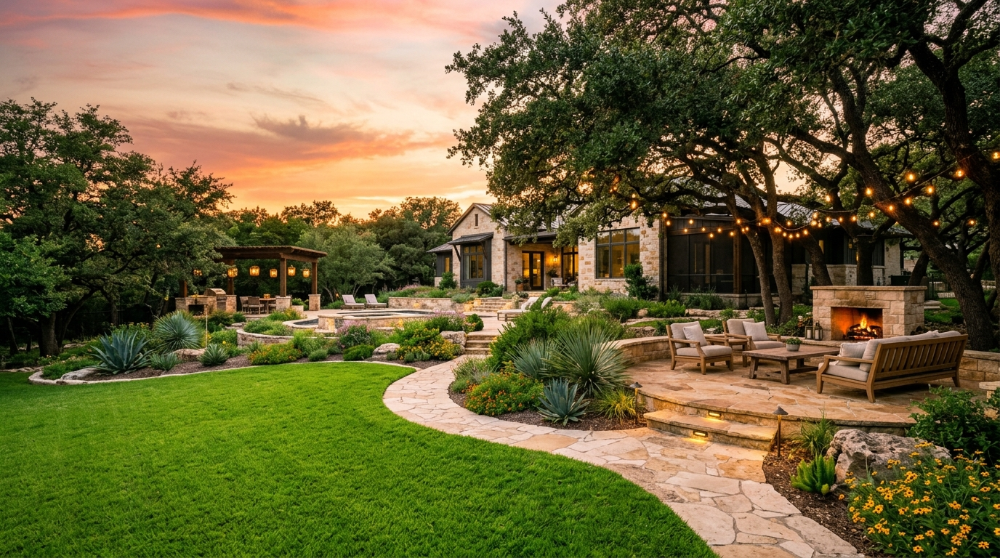

<div align="center">
  <br />
  <a href="https://saidur289.github.io/landscaping-website/">
    
  </a>
  <br />
  <br />

  <h1 align="center">Summit Ridge Landscaping</h1>

  <p align="center">
    <strong>A Premium, High-Conversion Landing Page for Elite Landscaping Services.</strong>
    <br />
    <br />
    <a href="https://saidur289.github.io/landscaping-website/"><strong>Explore Live Demo »</strong></a>
    <br />
    <br />
  </p>

  <p align="center">
    
    
    
    
  </p>
</div>

<br />

<!-- Banner Image -->
<div align="center">
  <a href="https://saidur289.github.io/landscaping-website/">
    
  </a>
</div>

<br />

> **Note:** The live site features a dynamic, scroll-scrubbed background video that plays frame-by-frame as you navigate the page. Experience it directly on the [Live Demo](https://saidur289.github.io/landscaping-website/).

---

## 🎨 Design System

We believe digital spaces should feel as intentional and curated as physical landscapes. The design system leverages high-contrast display typography and an organic, earthy color palette.

### 🎨 Color Palette

| Name | Hex | Preview | Usage |
| :--- | :--- | :---: | :--- |
| **Deep Forest** | `#1B4332` |  | Primary backgrounds, hero overlays, buttons |
| **Warm Gold** | `#D4A84B` |  | Accents, statistics, primary call-to-actions |
| **Soft Cream** | `#FAF7F0` |  | Base background, large text sections |
| **Dark Bark** | `#3D2C1E` |  | Primary typography on light backgrounds |

### ✒️ Typography

- **Display & Headings:** `Abril Fatface` (reminiscent of heavy, high-contrast serif foundry types).
- **Body Content:** `Source Sans 3` (clean, highly legible sans-serif).

---

## ✨ Signature Features

<table>
  <tr>
    <td width="50%">
      <h3>🎬 Interactive Video Hero</h3>
      <p>A cinematic entry point where the background video's playback is tied directly to the user's scroll position, creating an immediate sense of immersion.</p>
    </td>
    <td width="50%">
      <h3>🧊 Glassmorphism UI</h3>
      <p>Key data points and navigation elements utilize <code>backdrop-filter</code> blurring techniques to float elegantly above the content layers without obscuring them.</p>
    </td>
  </tr>
  <tr>
    <td width="50%">
      <h3>⚡ Buttery Scroll Reveals</h3>
      <p>Using the native <code>IntersectionObserver</code> API, elements naturally fade and glide into view, maintaining 60fps performance without relying on heavy animation libraries.</p>
    </td>
    <td width="50%">
      <h3>🖼️ CSS Masonry Gallery</h3>
      <p>A beautifully orchestrated portfolio gallery built strictly with CSS Grid and Flexbox techniques, adapting flawlessly to mobile, tablet, and ultra-wide screens.</p>
    </td>
  </tr>
</table>

---

## 🛠️ Built Without Bloat

This project is a testament to the power of the modern web platform. It avoids large JavaScript frameworks and CSS pre-processors, proving that premium experiences can be built natively.

*   **Markup**: Semantic HTML5.
*   **Styling**: Pure CSS3 with Custom Properties (Variables), advanced Grid/Flexbox layouts, and modern viewport units (`dvh`).
*   **Logic**: Vanilla ES6 JavaScript.

---

## 🚀 Quick Start (Local Development)

Because the project is entirely static, spinning it up locally takes seconds.

### 1. Clone the repository
```bash
git clone https://github.com/Saidur289/landscaping-website.git
cd landscaping-website
```

### 2. Serve it locally
You can use any local static server. Here are two quick methods:

**Using Node.js:**
```bash
npx serve .
```

**Using Python:**
```bash
python -m http.server 8000
```

### 3. Experience it
Open `http://localhost:3000` (or `8000`) in your favorite browser.

---

## 🤝 Contributing

We welcome aesthetic tweaks, code optimizations, and feature expansions! 

1. **Fork** the repository.
2. **Create a branch** for your feature: `git checkout -b feature/organic-animations`
3. **Commit** your changes: `git commit -m 'feat: added organic button hover states'`
4. **Push** to the branch: `git push origin feature/organic-animations`
5. **Open a Pull Request**.

---

## 📝 License

Distributed under the MIT License. See `LICENSE` for more information.

<br />

<div align="center">
  
  <p><i>Crafted with care for Summit Ridge Landscaping</i></p>
</div>
